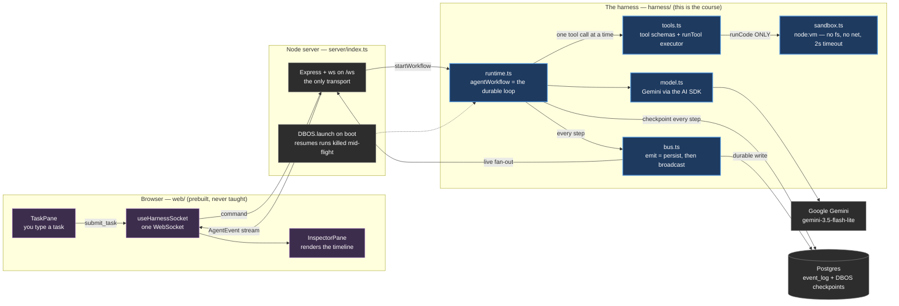
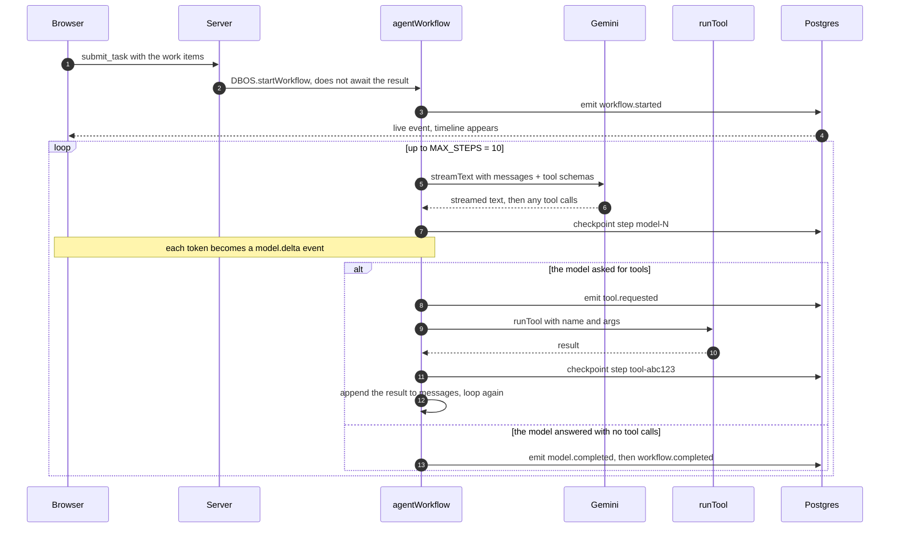
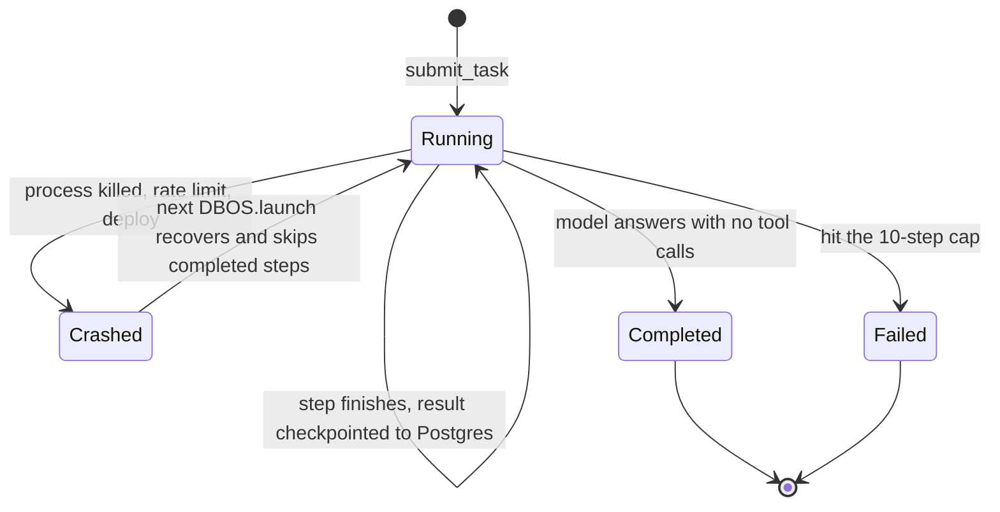
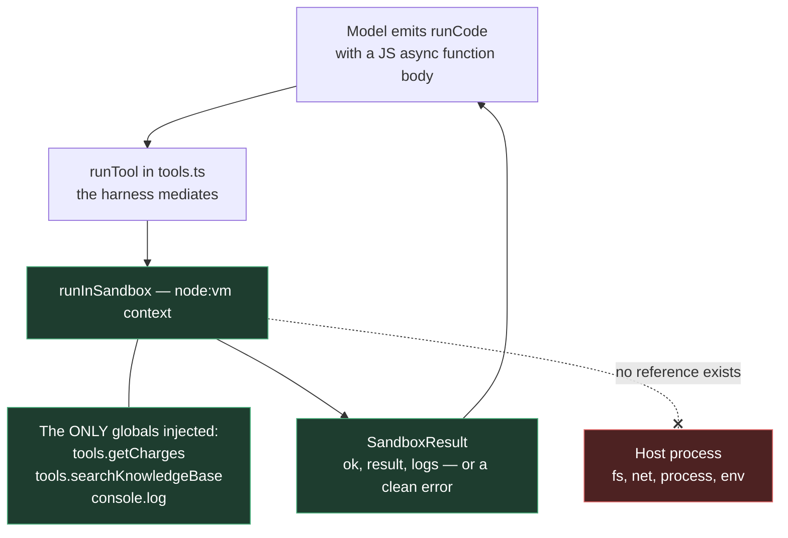
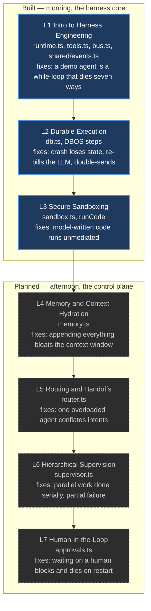

# Architecture at a glance

A map of this repo for when you come back to it cold. One idea to hold onto:

> **The LLM decides the next semantic step. The harness owns execution.**
> The agent here is deliberately boring support triage. The `harness/` directory is the product.

---

## 1. The big picture

Who talks to whom. Everything runs on your laptop.



Two things this diagram is trying to make obvious:

- **Nothing reaches the browser except events.** The UI never calls the model or a tool. It is a
  pure projection of the event stream defined in `shared/events.ts`, which is why invisible infra
  becomes visible on screen.
- **The socket is bidirectional and long-lived.** That's deliberate: a request-scoped transport like
  the AI SDK's `useChat` can't express server-initiated events such as a sub-agent finishing or a
  workflow resuming days later.

---

## 2. One task, end to end

What actually happens when you hit submit. Each `checkpoint` is a DBOS step boundary — a point the
system can crash and resume from.



The loop is a plain `while` — that's the point. The interesting part is that every non-deterministic
thing (the model, the tools, the clock) is wrapped in a DBOS step, so the workflow body itself can
be safely re-run from the top on recovery while completed steps are served from their checkpoints.

---

## 3. Why a crash doesn't hurt

The failure this is built to survive: the process dies right after `sendReply` really emailed a
customer. Naively you re-run and email them twice, and re-pay for every LLM call.



Two separate durability mechanisms share one Postgres database, which is easy to conflate:

| Mechanism | Owner | What it buys |
|---|---|---|
| `event_log` table | `harness/db.ts` + `bus.ts` | The timeline survives restarts, so a fresh inspector can replay all history |
| DBOS step checkpoints | `@dbos-inc/dbos-sdk` | Each model call and tool call runs **exactly once**, even across a crash |

---

## 4. Code Mode and the security boundary

Lesson 3's move: rather than chaining a dozen tool calls that each round-trip through the model,
the agent writes **one program** and the harness runs it in a sandbox.



The injected API is deliberately **read-only**, which is what lets the whole `runCode` call be a
single durable step: re-running it after a crash can't duplicate a side effect. Side-effecting tools
like `sendReply` stay outside the sandbox as their own steps.

Be honest about the limit, because the lesson notes are: `node:vm` is not a true security boundary,
and its `timeout` can't interrupt async code. The harness's job is to **mediate** the boundary; how
strong that boundary is becomes a deployment choice (e2b, Cloudflare Sandbox SDK, Fly, Daytona).

---

## 5. The seven lessons, as modules

Each lesson adds one module to the same runtime. Solid = on `main` today, dashed = later lessons.



`shared/events.ts` already declares the event types for all seven lessons — memory compaction,
handoffs, plans, sub-agents, approvals. Reading that enum top to bottom is the fastest way to see
where the course is going.

---

## 6. File map

| Path | What it is |
|---|---|
| `harness/runtime.ts` | The durable agent loop. The spine of the whole course |
| `harness/bus.ts` | `emit` writes the event to Postgres, then fans it out to listeners |
| `harness/db.ts` | Drizzle + postgres.js; owns the `event_log` table |
| `harness/tools.ts` | Tool schemas the model sees, plus the harness-owned `runTool` executor |
| `harness/sandbox.ts` | `node:vm` isolation for model-written code |
| `harness/model.ts` | The single place the Gemini model is configured |
| `harness/system-prompt.ts` | The triage instructions and the sample task |
| `shared/events.ts` | `AgentEvent` — the contract between harness and UI |
| `server/index.ts` | Express + ws, DBOS launch and recovery, `submit_task` handling |
| `web/` | The prebuilt inspector. Renders events, never calls the harness directly |
| `lessons/` | VitePress notes, one folder per lesson |
| `scripts/` | `test-sandbox.ts` and `inspect-log.ts` — poke at pieces in isolation |

## 7. Running it

```bash
npm run dev        # harness server on :8787 + inspector on :5173
npm run docs       # lesson notes via VitePress on :5174
npm run typecheck
```

Needs `.dev.vars` with `GOOGLE_GENERATIVE_AI_API_KEY` and `DATABASE_URL` (any Postgres; Neon works).
